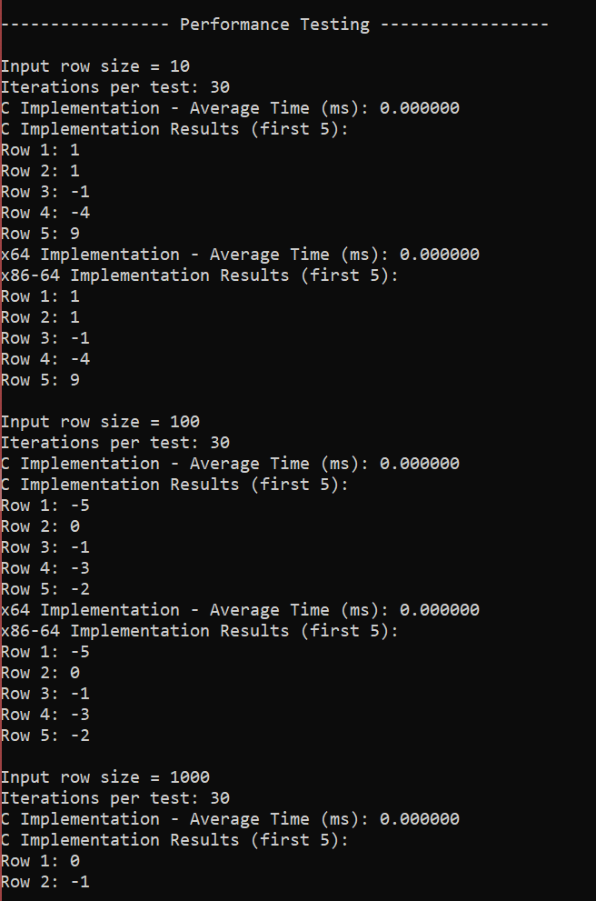

# x86-to-C-Acceleration-Computation-Program

# Acceleration Computation Program

## Project Description
This project calculates car acceleration based on initial velocity, final velocity, and time using x86-64 assembly and C.

## Prerequisites
- NASM (Netwide Assembler)
- GCC (GNU Compiler Collection)

## How to Compile

### Step 1: Assemble the Assembly File
```bash
nasm -f win64 AccelerationComputation.asm -o AccelerationComputation.o
```
- `-f win64`: Specifies the output format for 64-bit Windows
- Creates an object file from the assembly source

### Step 2: Compile the C Source File
```bash
gcc -c AccelerationComputation.c -o AccelerationComputation.obj -m64
```
- `-c`: Compile without linking
- `-m64`: Compile for 64-bit architecture
- Creates an object file from the C source

### Step 3: Link the Object Files
```bash
gcc AccelerationComputation.o AccelerationComputation.obj -o AccelerationComputation.exe -m64
```
- Links the assembly and C object files
- Creates the final executable

## Running the Program
```bash
AccelerationComputation.exe
```

## Input Format
- First, enter the number of cars
- For each car, enter:
  1. Initial Velocity (km/h)
  2. Final Velocity (km/h)
  3. Time (seconds)

## Example Input
```
Enter number of cars: 3
Car 1: 0.0, 62.5, 10.1
Car 2: 60.0, 122.3, 5.5
Car 3: 30.0, 160.7, 7.8
```

## Output
- Displays acceleration for each car in m/s²
- Shows average execution time over 30 runs

## Execution Time and Performance Analysis




For input sizes 10, 100, and 1000, both the x86-64 assembly and the C implementation take effectively 0.000000 ms. Both functions computed acceleration quickly and efficiently such that the program is unable to capture any significant differences in execution time.

For the largest tested input size, 10000, there was a noticeable change in execution time. The C implementation displayed an execution speed of 0.132600 ms.

As exoected, the x86-64 implementation's execution time stayed at 0.000000 ms despite an input size of 10000, proving that assembly runs significantly faster than C.

## Correctness Check

A correctness check was done using the sample input given in the specifications.


## Demo Video

A demo video of the group explaining the C and x86-64 programs' source code, compilation, execution was recorded. The video is uploaded in the Demo folder and on YouTube.

[Watch Demo Video on YouTube]([https://www.youtube.com/watch?v=example](https://youtu.be/3dNcPXV99bw))
